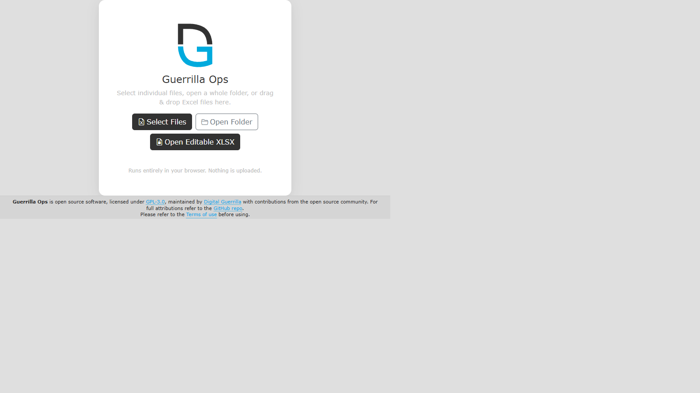

# Getting started

[Guide index](README.md) | Next: [Find, filter, and group](02-find-filter-group.md)

This guide explains how to start a session, choose the correct file mode, append more workbooks, and recognise the main parts of the screen.

## Before you begin

You need:

- A modern web browser.
- Internet access while opening the page so the interface libraries can load.
- One or more COBie workbooks in `.xlsx`, `.xls`, or `.xlsm` format.
- Chrome or Edge if you want to update selected `.xlsx` files directly.

Open the [live application](https://digital-guerrilla.github.io/Guerrilla-Ops/Guerrilla-Ops.html) or open `Guerrilla-Ops.html` locally.

On first load, the page opens to the upload screen. The top header appears after at least one workbook is loaded.

## Choose a loading mode

| Action | Session mode | Result when saving |
| --- | --- | --- |
| **Select Files** or **Load Files** | Standard | Updated workbooks are downloaded |
| **Open Folder** or **Load Folder** | Standard | Every supported workbook in the selected folder is loaded; saves are downloaded |
| **Open Editable XLSX** or **Open Editable** | Editable | Selected `.xlsx` files can be updated directly |
| Drag files onto the start screen | Standard | Updated workbooks are downloaded |

> [!IMPORTANT]
> Choose the mode you intend to use for the whole session. Editable and standard workbooks cannot be mixed in one session.

### Standard mode

Use standard mode when you want to review files safely, work with `.xls` or `.xlsm`, or save updated copies without changing the selected originals.

After the first workbook loads, the header shows **Load Files** and **Load Folder**. Use either action again to append more workbooks.

### Editable mode

Use **Open Editable XLSX** when you want Chrome or Edge to grant the page permission to update the selected `.xlsx` files.

After the first workbook loads, the header shows only **Open Editable**. Use it again to append more editable workbooks.

The browser may ask for file access again when saving. This is a browser security feature.

## Append more workbooks

Loading another file does not remove the current tables. It appends the new workbook to the same estate-wide session.

1. Use the loading action in the header.
2. Select one or more additional workbooks.
3. Wait for the loaded-workbook count to update.
4. Use the **Facility** filter to isolate one building if needed.

Existing filters and unsaved edits remain in memory. The newly loaded workbook is also added to the session's **Discard All** baseline.

## Understand the main screen

The screen is arranged from top to bottom:

1. **Header**: workbook count, global search, unsaved-change count, Close, and the matching append action.
2. **Summary**: totals for facilities, types, components, spaces, systems, and documents.
3. **Filter panels**: Facility, Floor, Space, Type, System, and Document Category.
4. **Results toolbar**: Asset View, Document View, QA View, Create, active filters, and grouping controls.
5. **Results panel**: grouped components, documents, or QA findings.
6. **Footer**: project attribution, license reference, and **Terms of use** popup link.

## Privacy and session safety

Workbook parsing and editing happen in the browser. Guerrilla Ops does not upload workbook data to an application server.

Changes are held in browser memory until you save. Refreshing the page or closing the tab loses unsaved changes. The browser displays a warning when changes exist.

## Close the session

Select **Close** to remove all loaded workbooks and return to the start screen. If unsaved changes exist, confirm whether they should be discarded.

## Next step

Continue to [Find, filter, and group](02-find-filter-group.md).
