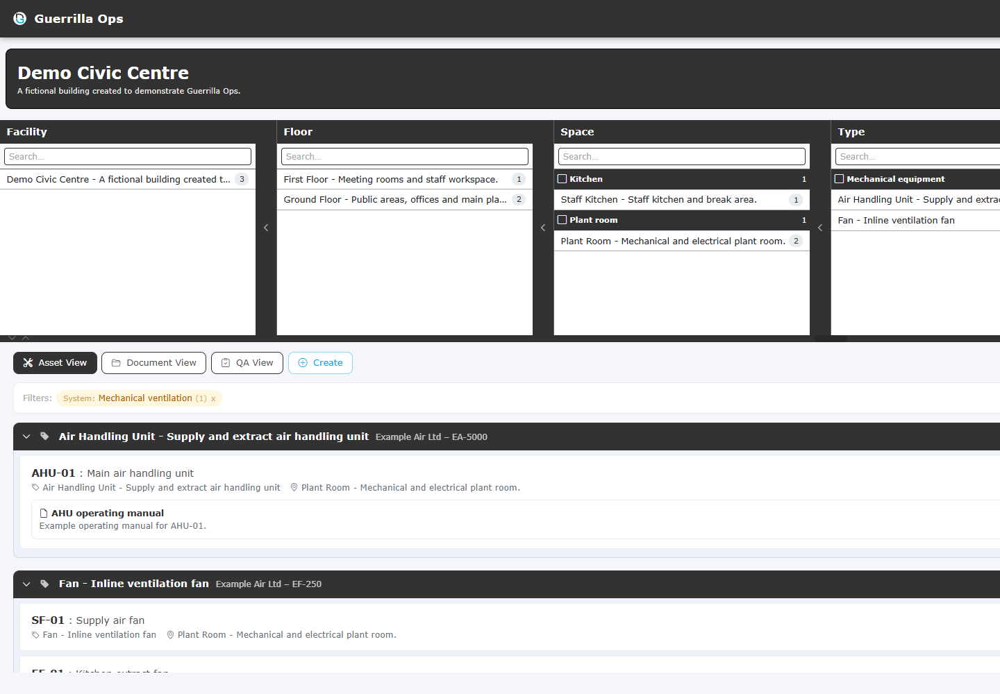
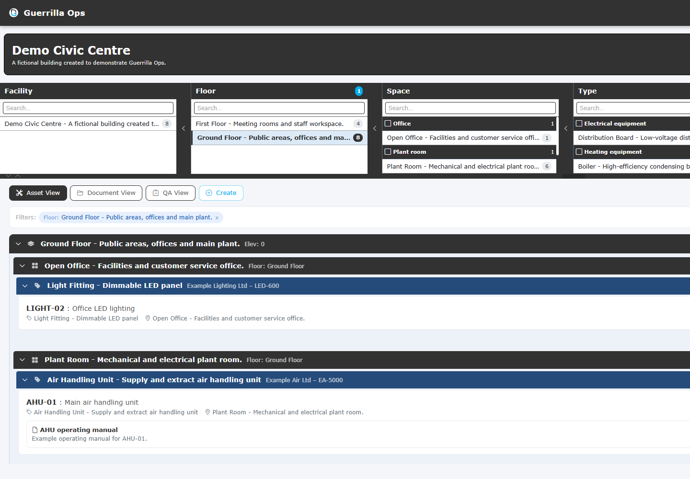

# Find, filter, and group

[Guide index](README.md) | Previous: [Getting started](01-getting-started.md) | Next: [Asset View](03-asset-view.md)

Use search, filters, and grouping together to reduce a large set of COBie records to the information you need.

## Use global search

The search box in the header checks component and document information, including names, descriptions, identifiers, tags, serial numbers, manufacturers, categories, and links.

1. Enter part of a word or identifier.
2. Review the counts and results as they update.
3. Select the **X** in the search box to clear it.

Global search works with the active filters. If a result is unexpectedly missing, clear search and filters before testing another term.

## Use the six filter panels

The filter area contains:

- **Facility**
- **Floor**
- **Space**
- **Type**
- **System**
- **Document Category**

Select an item to add it to the active filter. Select it again, or remove its coloured pill, to clear it.

The number beside an item is a cross-filter count. It shows what would remain under the other active selections. Counts in Document View represent unique documents, not repeated COBie Document rows.

### Search inside one panel

Each filter panel has its own search field. This changes only the visible choices in that panel; it does not filter the results directly.

### Clear active filters

- Remove one filter with the **X** on its pill.
- Select **Clear all** to remove every selected Facility, Floor, Space, Type, System, and Document Category.

### Resize the filter area

- Drag the dark resize bar below the panels.
- Use the up and down controls on the bar to maximise or minimise it.
- Select a panel's narrow heading to collapse or expand that panel.

## Understand relationship-aware document filtering

Documents keep the context recorded in the COBie Document sheet:

- A Facility document belongs to its Facility.
- A Floor document belongs to its Floor and Facility.
- A Space document belongs to its Space, Floor, and Facility.
- A Type document belongs to its Type and Facility.
- A System document belongs to its System and Facility.
- A Component document can also use its component's Type, Space, Floor, System, and Facility context.

A Facility or Type document is not copied onto every descendant component. This prevents misleading component totals.

Selecting a **Document Category** from Asset View automatically opens Document View so the matching documents are visible.

## Group the results

The **Group** row controls the hierarchy in the results panel.

1. Select a group chip to activate it.
2. Select more chips to add levels.
3. Drag chips left or right to set the level order.
4. Select a group header to open one level.
5. Use **Expand All** to open every level.

Useful arrangements:

| Task | Group order |
| --- | --- |
| Walk a building by location | Floor -> Space -> Type |
| Review a service | System -> Type |
| Compare buildings | Facility -> Type |
| Organise document packs | Facility -> Document Category |

A group such as **(No Type)** is meaningful. It means the document or record does not have that relationship; the result is retained rather than hidden.

## Work across several facilities

When several workbooks are loaded:

- Select a Facility before editing or creating records.
- Put Facility first in the group order for an estate-wide review.
- Clear Facility to compare all loaded workbooks.

## If no results appear

1. Check whether global search still contains text.
2. Review all active filter pills.
3. Clear all filters.
4. Confirm the appropriate view is active.
5. Expand the result groups.
6. See [Troubleshooting and data notes](08-troubleshooting-data.md) if counts remain unexpected.
