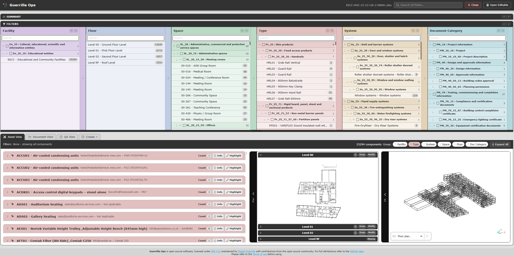
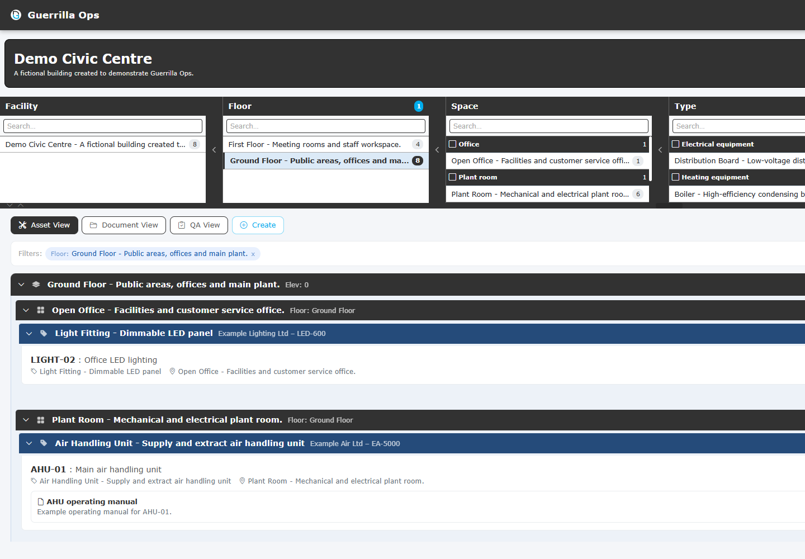

# Find, filter, and group

[Guide index](README.md) | Previous: [Getting started](01-getting-started.md) | Next: [Asset View](03-asset-view.md)

Use search, filters, and grouping together to reduce a large set of COBie records to the information you need.

## Use global search

The search box in the header checks component and document information, including names, descriptions, identifiers, tags, serial numbers, manufacturers, categories, and links.

1. Enter part of a word or identifier.
2. Review the counts and results as they update.
3. Select the **X** in the search box to clear it.

Global search works with the active filters. If a result is unexpectedly missing, clear search and filters before testing another term.

## Use the filter tabs

The vertical rail on the right contains icons for the following filters. Hover
over an icon to see its name:

- **Facility**
- **Floor**
- **Zone**
- **Space**
- **Type**
- **System**
- **Document Category**

Select a tab to open its drawer to the left of the rail. Only one drawer is open
at a time. Select the same tab again, its close button, or press **Escape** to
close it. Switching or closing drawers preserves selections and panel searches.

Select an item to add it to the active filter. Select it again, or remove its coloured pill, to clear it. Closed tabs show their selected-item counts.

The number beside an item is a cross-filter count. It shows what would remain under the other active selections. Counts in Document View represent unique documents, not repeated COBie Document rows.

### Search inside one panel

Each filter panel has its own search field. This changes only the visible choices in that panel; it does not filter the results directly.

### Clear active filters

- Remove one filter with the **X** on its pill.
- Select **Clear all** to remove every selected Facility, Floor, Zone, Space, Type, System, and Document Category.

### Work in a filter drawer

Drawers overlay the right side of the results without moving the viewers.
Use the existing classification arrows to expand or collapse one level.
Tab heights expand or shrink equally to fit the rail's available height.
At shorter heights, the grip is hidden and the icon and grouping checkbox
sit side by side; drag the icon to reorder. The drawer fits the available width.

## Understand relationship-aware document filtering

Documents keep the context recorded in the COBie Document sheet:

- A Facility document belongs to its Facility.
- A Floor document belongs to its Floor and Facility.
- A Space document belongs to its Space, Floor, and Facility.
- A Type document belongs to its Type and Facility.
- A System document belongs to its System and Facility.
- A Component document can also use its component's Type, Space, Floor, System, and Facility context.

A Facility or Type document is not copied onto every descendant component. This prevents misleading component totals.

Selecting a **Document Category** from Asset View automatically opens Document View so the matching documents are visible.

## Group the results

The unlabelled checkbox on each right-hand tab controls whether that dimension
is used in the result hierarchy. Opening a drawer and selecting filters are
independent of grouping. Hover over a checkbox to see **Group by** and its dimension.

1. Check a tab's checkbox to activate that level.
2. Check more tabs to add levels; uncheck a tab to remove its level.
3. Drag a tab's icon or grip up or down to set the level order. Other tabs animate
   out of the way while you drag; the hierarchy is recomputed only when you drop.
   The grabbed point stays under the pointer, including when you move left of
   the rail. Press **Escape** to cancel a drag without changing the hierarchy.
   The highest enabled tab
   is the outermost group; unchecked tabs do not add levels. Alternatively,
   focus an icon or grip and press **Alt + Up/Down**.
4. Select a group header to open one level.
5. Use **Expand All** to open every level.

Group headers also provide **Info** and **Highlight** actions. **Info** opens
the shared Information view for that Facility, Floor, Space, Type, or System.
**Highlight** keeps the matching records visually emphasised until you remove
the highlight or select **Remove all highlights**.

Useful arrangements:

| Task | Group order |
| --- | --- |
| Walk a building by location | Floor -> Space -> Type |
| Review a service | System -> Type |
| Compare buildings | Facility -> Type |
| Organise document packs | Facility -> Document Category |

A group such as **(No Type)** is meaningful. It means the document or record does not have that relationship; the result is retained rather than hidden.

In QA View, entity Group controls retain their existing single-sheet scope
behaviour rather than adding nested asset levels. Closing the workbook resets
the tab order and grouping; they are not saved as preferences.

## Work across several facilities

When several workbooks are loaded:

- Select a Facility before editing or creating records.
- Put Facility first in the group order for an estate-wide review.
- Clear Facility to compare all loaded workbooks.

## If no results appear

1. Check whether global search still contains text.
2. Review all active filter pills.
3. Clear all filters.
4. Confirm the appropriate view is active.
5. Expand the result groups.
6. See [Troubleshooting and data notes](08-troubleshooting-data.md) if counts remain unexpected.
