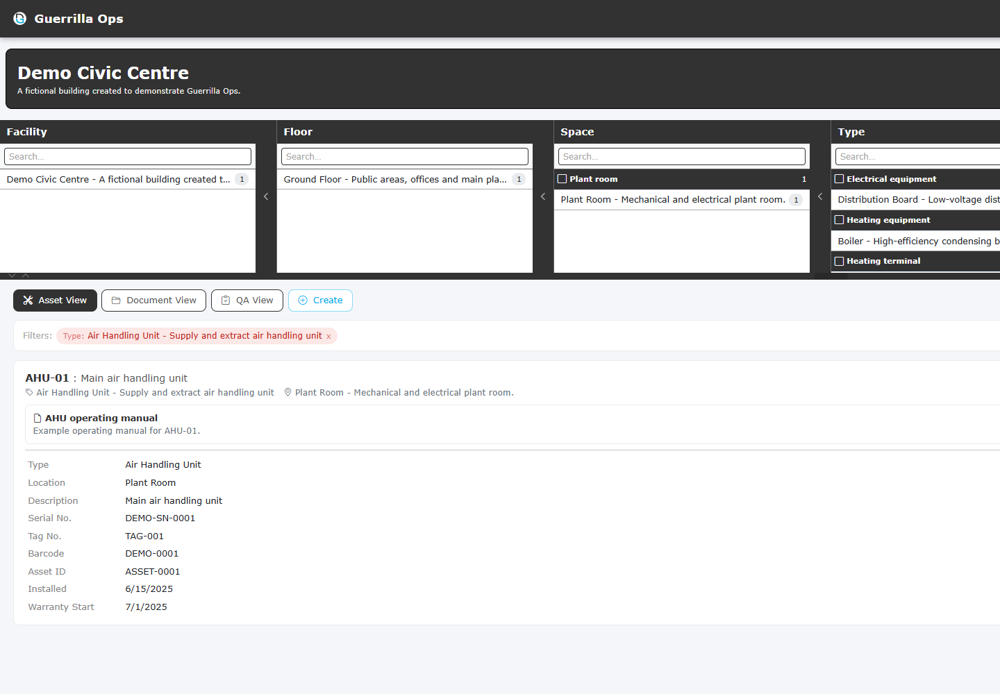

# Asset View

[Guide index](README.md) | Previous: [Find, filter, and group](02-find-filter-group.md) | Next: [Document View](04-document-view.md)

Asset View is the default workspace for installed components and their COBie relationships.

## Open Asset View

Select **Asset View** above the results. Current Facility, Floor, Space, Type, and System filters continue to apply.

## Read a component card

A component card can show:

- Component name and description.
- Type.
- Space or location.
- Linked document badges.
- A **Details** action.
- An **Edit** pencil action.

Select **Details** to reveal available fields such as serial number, tag number, barcode, asset identifier, installation date, and warranty start date.

Blank fields are omitted from the compact details table.

## Use group information

Grouped headers can provide an information action such as **Type Info**, **System Info**, **Space Info**, **Floor Info**, or **Facility Info**.

The information window shows available properties and linked documents. Use its **Edit [record]** action to open the full editor.

## Follow relationships

Asset View uses the COBie references stored on each row:

- `Component.TypeName` links a component to a Type.
- `Component.Space` links it to a Space.
- Space data links the location to a Floor.
- System component lists link components to Systems.
- Every imported row is scoped to its source Facility.

QA View reports missing or unresolved references rather than inventing relationships.

## Work with component documents

Document badges on a component card represent documents linked to that component. Select a badge to view the document details, open its link, or edit the document row.

Type, Space, Floor, System, and Facility documents are best reviewed in Document View. They are not automatically treated as documents owned by every descendant component.

If you select a Document Category, Guerrilla Ops opens Document View. You can return to Asset View to see components with directly linked component documents in that category.

## Edit a component

Select the pencil action on a component card. Depending on the data, the editor lets you update:

- General component properties.
- Type.
- Space.
- System memberships.
- Linked documents.

Changing a component name also updates matching component references in System and Document data for the same Facility.

For full instructions, see [Edit and create records](06-edit-create.md).

## Useful Asset View workflows

### Find an asset by identifier

1. Search for its component name, tag, serial number, barcode, or asset identifier.
2. Group by Facility or Type if more than one result remains.
3. Open **Details**.

### Review all assets in one room

1. Select the Facility.
2. Select the Floor.
3. Select the Space.
4. Group by Type or System.

### Review one system

1. Select the Facility.
2. Select the System.
3. Group by Type.
4. Expand all groups.
