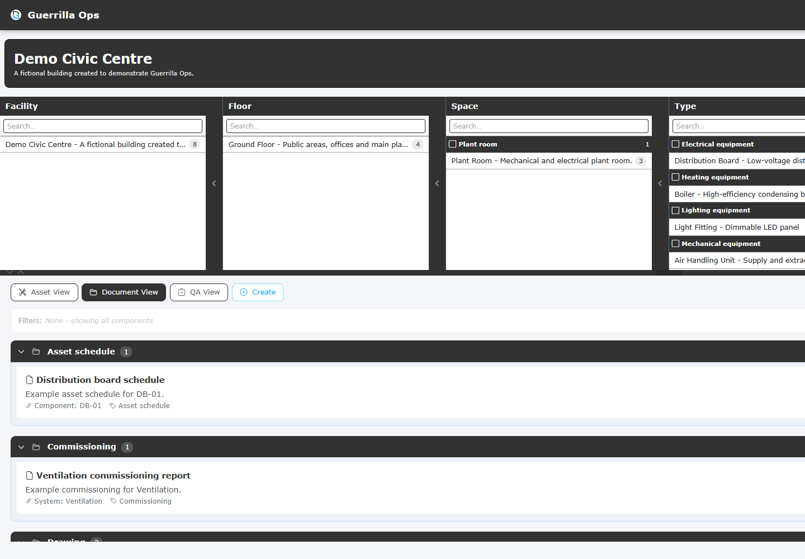

# Document View

[Guide index](README.md) | Previous: [Asset View](03-asset-view.md) | Next: [QA View](05-qa-view.md)

Document View brings manuals, drawings, certificates, reports, and other COBie Document records into one relationship-aware list.

## Open Document View

Select **Document View**, or select a value in the **Document Category** filter. Selecting a category from Asset View switches to Document View automatically.

The result counter shows unique documents. Repeated COBie rows that point to the same Facility and Directory link are treated as one logical document for display and counts.

## Filter documents

You can combine Document Category with Facility, Floor, Space, Type, or System.

The available choices reflect the document's real relationship context. For example, a Type document can filter its Facility and Type, but does not automatically make every component, Space, Floor, or System a match.

This distinction is important when checking whether documentation has been attached at the correct COBie level.

## Group documents

Use the same draggable group controls as Asset View. Useful arrangements include:

- Facility -> Document Category
- System -> Document Category
- Floor -> Space -> Document Category
- Type -> Document Category

Groups such as **(No Type)** or **(No System)** mean the document is not related at that level. The document remains visible under that heading.

## Read a document card

A document card shows:

- Name or document number.
- Description.
- Relationship level and linked record.
- Category.
- **Link**, details, and **Edit** actions when available.

Select the information action to open a details window. Select **Link** to open the Directory value.

## Understand the Link field

Guerrilla Ops uses the COBie `Directory` value as the complete link. It does not join `Directory` and `File`.

Supported values can include:

- `https://` web addresses.
- `file:` addresses.
- Windows drive paths such as `C:\Documents\Manual.pdf`.
- UNC paths such as `\\server\share\Manual.pdf`.

Whether a local or network path opens depends on browser and security policy. Copy the path and open it in File Explorer when direct opening is blocked.

## Edit a document directly

Select the document's pencil action. The direct document editor contains:

- **Name**
- **Description**
- **Category**
- **Link** (`Directory`)

It does not edit the linked Component, Type, Space, Floor, System, or Facility.

To change the link:

1. Select **Edit** beside the current link.
2. Paste the complete URL or path, or select **Browse**.
3. Select **Save Changes**.

Browsers usually do not reveal a selected file's full local path. If the full path is required, paste it manually.

## Add or remove documents from an entity

Open the linked entity's full editor and use its **Documents** section:

- Select **Add** to create a Document row linked to that entity.
- Use the trash action to remove a linked row.
- Complete Name, Description, Category, and Link.

These changes remain unsaved until you update or download the workbook.
