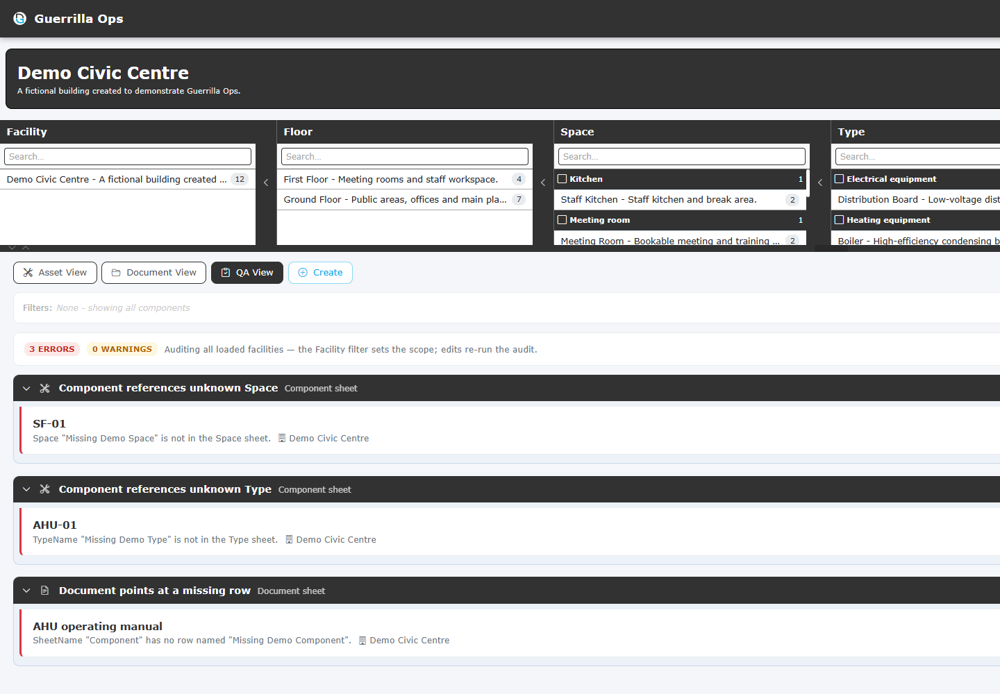

# QA View

[Guide index](README.md) | Previous: [Document View](04-document-view.md) | Next: [Edit and create records](06-edit-create.md)

QA View audits loaded COBie data for common completeness and relationship problems.

## Start an audit

> [!NOTE]
> The screenshot uses deliberate in-memory broken references to demonstrate QA findings. The supplied example workbook opens with a clean audit.

1. Select **QA View**.
2. Optionally select one or more Facilities to limit the audit.
3. Review the summary counts and grouped findings.
4. Expand a group to inspect individual records.

If no Facility is selected, every loaded Facility is audited.

## Understand severity

| Severity | Meaning | Suggested response |
| --- | --- | --- |
| **Error** | A key record or required relationship cannot be resolved | Investigate first |
| **Warning** | Data is missing or likely to reduce usefulness | Review and correct where appropriate |
| **Info** | A condition is worth noting but may be intentional | Confirm against project requirements |

Severity indicates data quality risk, not necessarily workbook corruption.

## Checks you may see

QA View checks areas such as:

- Blank key names.
- Components referring to missing Types or Spaces.
- Spaces referring to missing Floors.
- Systems referring to missing Components.
- Documents referring to missing rows or unsupported sheets.
- `CreatedBy` values that do not resolve to Contact data.
- Missing or unusual Facility rows.
- Incomplete values on important records.

The exact findings depend on the sheets and relationships in the loaded workbooks.

## Fix a finding

Where a finding maps to an editable record, select its pencil action.

1. Read the finding message carefully.
2. Open the affected record.
3. Correct the property or association.
4. Select **Save Changes**.
5. Return to QA View. The dashboard rebuilds from the modified in-memory data.

Some findings describe a missing record. Use **Create** to add the missing Type, Space, Component, System, or Contact, then review the audit again.

## Download the QA report

Select **Download Report** to export the findings for review outside the application.

Use the report when:

- Assigning issues to information owners.
- Keeping evidence of a review.
- Working through a result group that is capped in the on-screen view.
- Comparing QA results before and after corrections.

The QA report is separate from saving workbook changes.

## Avoid misleading results

- Select the correct Facility when similarly named records exist in different workbooks.
- Clear global search if you need a complete audit view.
- Treat project-specific optional fields according to the project's information requirements.
- Save or download corrected workbooks before refreshing the browser.

## Next step

See [Edit and create records](06-edit-create.md) for detailed correction workflows.
