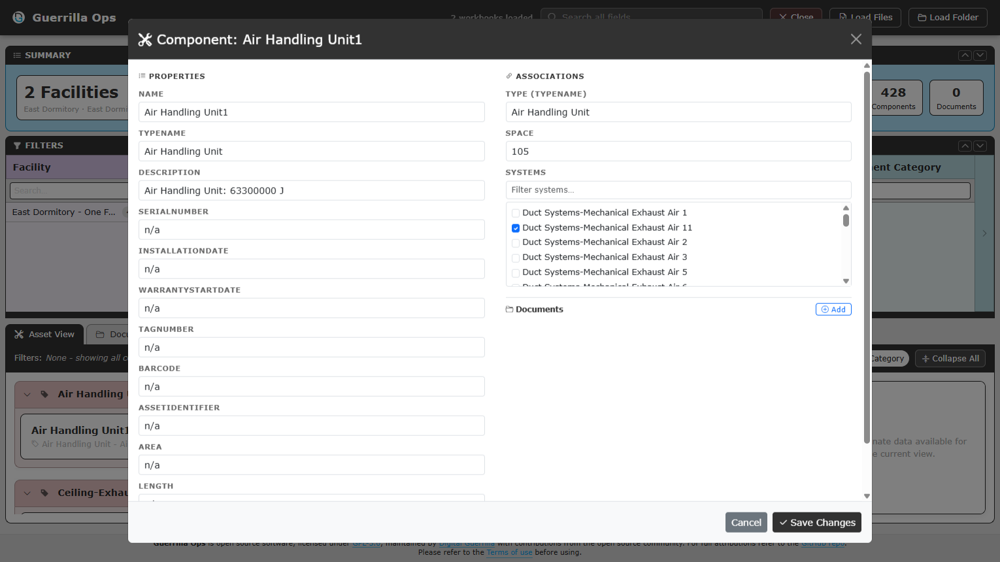

# Edit and create records

[Guide index](README.md) | Previous: [QA View](05-qa-view.md) | Next: [Save, discard, and close](07-save-close.md)

Edits and new records are applied to the in-memory COBie data immediately. They are not written to a workbook until you use an action in **Unsaved Changes**.

## Edit an existing record

Open an edit action from a group information window, document card, or QA finding. For components, open **Component info** from the card first, then select the edit action in that popup.

The editor usually separates:

- **Properties**: the fields stored on the record.
- **Associations**: linked Type, Space, Floor, Systems, Components, or Documents.

Select **Save Changes** to apply the form to the dashboard. Select **Cancel** to close it without applying the form.

## Rename records carefully

Names are COBie keys. Guerrilla Ops prevents duplicate names within the same Facility and updates supported references when a record is renamed.

Rename handling includes:

- Component names in System memberships and linked Documents.
- Type names on Components and linked Documents.
- Space names on Components and linked Documents.
- Floor names on Spaces and linked Documents.
- System names in filters and linked Documents.
- Facility scope across the loaded workbook data.

Review QA View after a significant rename.

## Change associations

Depending on the record type, the editor can provide:

- Type autocomplete for a Component.
- Space autocomplete for a Component.
- System membership checkboxes for a Component.
- Component membership checkboxes for a System.
- Floor selection for a Space.
- Linked Document rows.

Use the filter field above a long checkbox list to find the required System or Component.

If a Component is assigned a new Type name that does not exist, Guerrilla Ops prompts the workflow to create that Type after saving the Component.

## Edit linked documents

A linked document row includes Name, Description, Category, and Link.

- Select **Edit** beside Link to replace the complete Directory value.
- Select **Paste** to read a path or URL from the clipboard when browser permission allows it.
- Select **Browse** to choose a file. The browser may expose only its filename.
- Select the trash action to remove the Document row.
- Select **Add** to append a new linked Document row.

The hidden COBie `File` value on an existing row is retained for compatibility; the interface uses `Directory` as the complete link.

## Create a record

Select **Create**, then choose a record type.

### Space

Typical fields include Name, Category, Floor, Room Tag, Description, Usable Height, Gross Area, and Net Area.

### Type

Typical fields include Name, Category, Asset Type, Manufacturer, Model Number, Description, and warranty details.

### Component

Typical fields include Name, Type, Space, Description, Assembly Type, Serial Number, Installation Date, and Tag Number.

### System

Enter Name, Category, and Description, then select the member Components.

### Contact

Enter the unique Name, usually the COBie email identifier, plus person, company, contact, category, location, and organisation details.

## Choose the Facility

When more than one workbook is loaded, the Create window displays a Facility selector. Confirm this before creating the record.

Existing edits are also Facility-scoped. This allows similarly named records in separate workbooks to remain independent.

## Required and duplicate values

- Name is required for all creatable record types.
- Names must be unique for that record type within the selected Facility.
- A new record appears in the dashboard after creation, even if current filters would normally have a zero count.

## Review your work

After editing or creating:

1. Check the **Unsaved Changes** count.
2. Use **Refresh Display** if you want to force a dashboard rebuild.
3. Review the affected record in Asset, Document, or QA View.
4. Save before refreshing or closing the browser tab.
