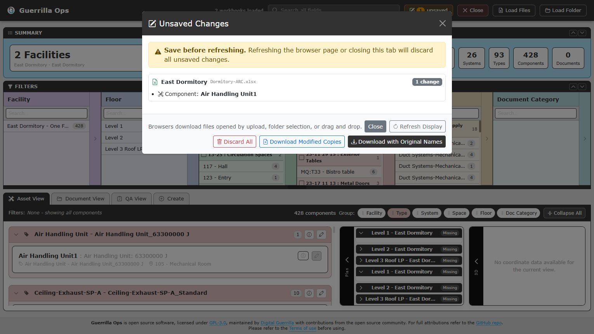

# Save, discard, and close

[Guide index](README.md) | Previous: [Edit and create records](06-edit-create.md) | Next: [Troubleshooting and data notes](08-troubleshooting-data.md)

Guerrilla Ops keeps changes in browser memory until you explicitly save or discard them.

## Open Unsaved Changes

After an edit or creation, an **Unsaved Changes** button appears in the header with the number of recorded changes.

Open it to review changes grouped by Facility and source workbook.

## Choose an action

| Action or primary-button label | What it does |
| --- | --- |
| **Close** | Closes the window; changes remain in memory |
| **Refresh Display** | Rebuilds indexes, filters, and results from current in-memory values |
| **Discard All** | Restores loaded workbook data to the session baseline |
| **Download Modified Copies** | Downloads updated copies without replacing selected originals |
| **Update Selected Files** | Directly updates `.xlsx` workbooks opened in editable mode |
| **Download with Original Names** | Downloads standard-mode workbooks using their source filenames |
| **Update / Download Files** | Handles a legacy mixed session by updating editable files and downloading others |

**Update Selected Files**, **Download with Original Names**, and **Update / Download Files** are alternate labels for the same primary save button. Only the label matching the current session is shown.

## Standard session saving

If the session began with **Select Files**, **Open Folder**, drag and drop, **Load Files**, or **Load Folder**, the browser cannot overwrite the selected originals.

Use:

- **Download Modified Copies** to keep clearly separate outputs.
- **Download with Original Names** when you intend to replace or relocate the originals yourself.

Check the browser's Downloads folder and any duplicate-filename suffix added by the browser.

## Editable session saving

If the session began with **Open Editable XLSX**, use **Update Selected Files**.

The browser creates writable access while the save action is active. It may ask for permission. Keep the page open until all files finish updating.

Only `.xlsx` files can be opened through this mode.

## Appending and the discard baseline

Additional workbooks are appended to the session.

- Existing unsaved edits remain active.
- New workbooks are added to the original-data baseline.
- **Discard All** removes edits but does not remove workbooks appended during the session.

Use **Close** if you want to remove every workbook and start again.

## Formatting and workbook contents

For standard `.xlsx` files, Guerrilla Ops updates managed COBie sheets while preserving source workbook packaging, formatting, colours, and unmanaged sheets where supported.

Legacy `.xls` and macro-enabled `.xlsm` files use a compatibility export path. Review those outputs carefully.

## Refresh and browser close warnings

Refreshing or closing the browser tab discards in-memory changes. A browser warning appears when changes are recorded, but the browser may use its own generic wording.

Always confirm that the updated or downloaded workbook exists before leaving the page.

## Close all workbooks

Select **Close** in the header to return to the opening screen.

- With no changes, the session closes immediately.
- With unsaved changes, confirm whether to discard them.
- Filters, search, grouping, mode, and loaded workbook data are reset.

## Recommended save check

1. Save or download the files.
2. Confirm the expected filenames and locations.
3. Open one output in Excel.
4. Check a changed cell and a retained unmanaged sheet.
5. Only then close the browser session.
