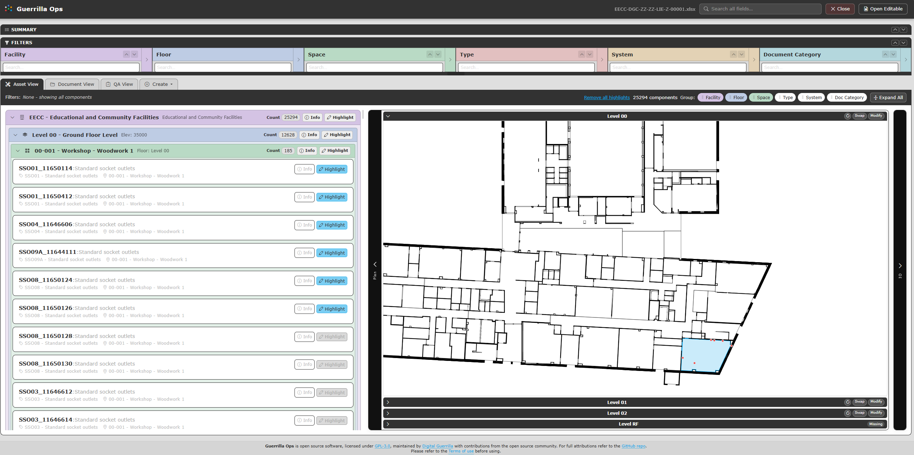

# Plan viewer

[Guide index](README.md) | Previous: [Troubleshooting and data notes](08-troubleshooting-data.md) | Next: [3D viewer](10-3d-viewer.md)

The Plan viewer displays an SVG drawing for each COBie Floor beside the
results. It can select Spaces, show filtered locations and component dots, and
provide the entry point for Plan-to-3D alignment.

## Data needed

The panel appears when the loaded data contains Floor rows. Each floor can use:

- A custom Floor Attribute named `svg`, containing inline SVG markup.
- Additional `svg` attribute chunks created by Guerrilla Ops for large drawings.
- Space rows whose Floor reference matches the Floor name.
- Space and Component Coordinate rows for alignment and location dots.

If a Floor has no SVG, its card shows **Missing**. Expand that floor and select
**Load SVG Here** to add one.

## Open and resize the panel

The panel is on the right of the result list.

- Select the vertical **Plan** edge control to collapse or reopen it.
- On a wide desktop, drag the panel's left edge to change its width.
- Select a floor heading to make that drawing active.

Filters control which floors remain available. If the expected floor is not
listed, clear the active Facility, Floor, Space, Type, System, and Document
Category filters before checking the source data.

## Navigate a drawing

Inside the expanded SVG:

- Use the mouse wheel to zoom around the pointer position.
- Left-drag the drawing to pan.
- Select the rotate icon in the floor heading to rotate the current view by 90 degrees.

The 90-degree rotate action changes only the current viewing orientation. Use
the alignment workflow when the plan itself must be mapped to the coordinate
system.

## Select and highlight Spaces

When SVG room elements can be matched to Space names or room identifiers:

1. Select a room in the plan to apply it as a Space filter.
2. Hold **Ctrl** while selecting to add or remove a room without clearing the existing Space selection.
3. Review the filter pill and matching results.

Asset filters and result highlights are reflected in both spatial viewers.
Where Component Coordinates are available, matching component positions are
drawn as dots on the aligned plan.

## Load or replace an SVG

For a missing drawing, expand the floor and select **Load SVG Here**. For an
existing drawing, select **Swap** in the floor heading.

1. Choose an `.svg` file.
2. Wait for the drawing to appear in the floor card.
3. Open **Unsaved Changes** and confirm the Floor change is listed.
4. If the replacement has different bounds or orientation, use **Modify** to realign it.

Guerrilla Ops sanitises uploaded SVG markup and stores it in custom Floor
attributes. **Swap** replaces the SVG but retains any existing alignment, so a
visually different replacement may require a new alignment.

## Align the plan

Select **Align** beside a floor that has not been aligned, or **Modify** when a
saved alignment already exists. See [Align Plan and 3D](11-align-plan-3d.md)
for the complete workflow.

## If the plan does not work

| Symptom | Check |
| --- | --- |
| Plan panel is absent | Confirm the workbook has valid Floor rows |
| Floor shows **Missing** | Load an SVG for that Floor |
| **Invalid SVG source** appears | Replace the value with valid SVG markup or a usable SVG link |
| Room selection does nothing | Check SVG room identifiers against Space names or room numbers |
| Component dots are misplaced | Check Component Coordinates and the saved floor alignment |
| The drawing disappears after reopening | Save or download the workbook after loading or swapping the SVG |

## Next step

Continue to the [3D viewer](10-3d-viewer.md).