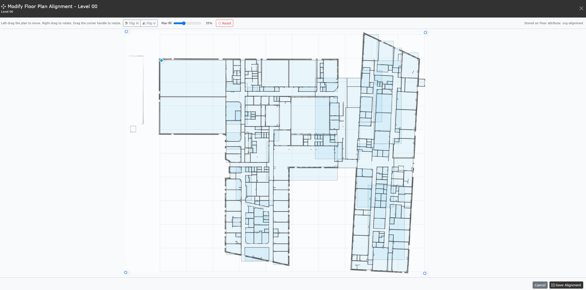

# Align Plan and 3D

[Guide index](README.md) | Previous: [3D viewer](10-3d-viewer.md) | Next: [Locate components](12-locate-components.md)

Alignment maps an SVG floor plan to the room boxes calculated from Space
Coordinate rows. The saved mapping is then reused for Plan component dots, the
3D floor overlay, SVG room geometry, and component placement.

## Before aligning

For the most useful alignment, confirm that the Floor has:

- A loaded SVG drawing.
- Space rows linked to that Floor.
- Valid lower-left and upper-right Coordinate rows for several Spaces.
- Correct Facility scope and matching Space names.

Alignment can open without coordinate room boxes, but there will be no spatial
reference to align against. Correct the Coordinate data first if the workspace
says **No room coordinate boxes found for this floor.**

## Open the alignment workspace

1. Open **Asset View** and find the **Plan** panel.
2. Expand the required Floor.
3. Select **Align** for the first alignment, or **Modify** for a saved alignment.

The workspace overlays the SVG on room boxes generated from Coordinate data.
The room boxes are the reference geometry; the translucent SVG is the drawing
being adjusted.

## Navigate the workspace

- Use the mouse wheel over empty workspace to zoom around the pointer.
- Left-drag empty workspace to pan the complete working view.
- Adjust **Plan fill** to see room boxes through dense drawing fills. This is a preview aid and is not the saved overlay opacity.

These navigation actions do not change the floor alignment.

## Move, rotate, and scale the SVG

Use the handles and mouse actions on the SVG shell:

| Action | Result |
| --- | --- |
| Left-drag the plan | Move the SVG over the room boxes |
| Right-drag the plan | Rotate around the blue origin handle |
| Drag a corner handle | Scale the SVG uniformly |
| Drag the blue origin handle | Move the rotation and scale origin |
| **Flip H** | Mirror the plan horizontally |
| **Flip V** | Mirror the plan vertically |

A reliable order is:

1. Use **Flip H** or **Flip V** if the plan is mirrored.
2. Move the blue origin to a recognisable common point when needed.
3. Right-drag to match the main building orientation.
4. Drag a corner to match the overall extents.
5. Left-drag for final position.
6. Compare several distant rooms, not only one local corner.

Use walls, cores, corridors, and unusual room shapes as references. Coordinate
boxes may be simplified rectangles, so aim for a consistent building-wide fit
rather than matching every line in the drawing.

## Reset, cancel, or save

- **Reset** returns the draft to the automatically calculated starting transform.
- **Cancel** closes the workspace and keeps the previously saved alignment.
- **Save Alignment** writes the current transform and closes the workspace.

After saving, **Align** changes to **Modify** for that Floor. A saved alignment
is recorded as a custom Floor Attribute named `svg-alignment`. Flip operations
are applied to the stored SVG when the alignment is saved. Both changes appear
under **Unsaved Changes** and are not permanent until the workbook is updated
or downloaded.

## Verify in Plan and 3D

1. Open the **Floor plan...** dropdown in the 3D viewer.
2. Select the aligned Floor.
3. Rotate the 3D view and compare the SVG plane with room geometry.
4. Select Spaces in Plan and 3D to confirm the same rooms respond.
5. Apply a Type or System filter, then check component dots and 3D component positions where Coordinates exist.

If the overlay is still offset, select **Modify**, make a smaller adjustment,
and save again.

## Replacing a drawing

**Swap** replaces the Floor SVG but retains the existing `svg-alignment`
attribute. If the new SVG uses different bounds, origin, or orientation, open
**Modify** and realign it before relying on component placement or location
dots.

## Troubleshoot alignment

| Symptom | Check |
| --- | --- |
| No room boxes are drawn | Confirm Space corner Coordinates and matching Floor references |
| Only some rooms appear | Check Facility scope, Space names, and both corner rows |
| Plan is mirrored | Use **Flip H** or **Flip V**, then refine rotation |
| Rotation behaves unexpectedly | Move the blue origin handle to a stable reference point |
| One area aligns but another does not | Review SVG distortion, coordinate units, and the source survey geometry |
| Alignment is lost after reopening | Save the alignment, then save or download the workbook from **Unsaved Changes** |
| New SVG no longer fits | **Swap** retains the old alignment; open **Modify** and save a new one |

## Related guides

- [Plan viewer](09-plan-viewer.md)
- [3D viewer](10-3d-viewer.md)
- [Edit and create records](06-edit-create.md), for component placement
- [Locate components](12-locate-components.md), for assigning component positions