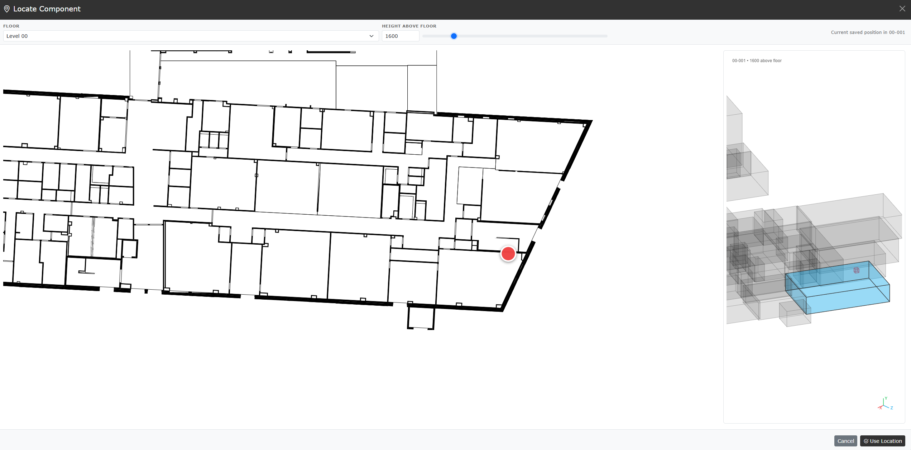

# Locate components

[Guide index](README.md) | Previous: [Align Plan and 3D](11-align-plan-3d.md)

The **Locate Component** workspace places a Component on a floor plan, assigns
its Space, and previews the resulting position in 3D. The location is stored as
Component Coordinate rows and can be reopened later for adjustment.

## Data needed

Before locating a Component, confirm that its Facility has:

- A Floor with a loaded SVG drawing.
- Space rows linked to that Floor.
- Valid lower-left and upper-right Coordinate rows for the target Space.
- SVG room elements whose identifiers match the corresponding Space names.

The Floor dropdown lists only floors with usable SVG drawings in the current
Facility. Complete [Align Plan and 3D](11-align-plan-3d.md) first when the SVG
does not already match the Space coordinate geometry.

## Open the workspace

You can locate an existing Component from either of these views:

- In **Asset View**, open the Component's **Info** window, find the Space
  association, and select **Locate in 2D / 3D**.
- Open **Edit Component**, find the Space field, and select **Locate**.

If usable Component Coordinates already exist, the workspace opens at the
saved floor, plan position, and height. The status reports the Space containing
the current saved position.

## Choose the floor and plan position

1. Select the required **Floor**.
2. Use the mouse wheel over the plan to zoom around the pointer.
3. Left-drag the plan to pan.
4. Select the required point inside a recognised room.
5. Confirm that a red marker appears at the selected point and the status names
   the expected Space.

Selecting a room also assigns that Space to the Component. Changing the Floor
clears the current draft position, so select a new room before continuing.

## Set the height

Enter the **Height above floor**, or use the slider beside it. Use a value in
the same units as the workbook Coordinate data; the value must be zero or
higher.

The height is measured from the bottom elevation of the selected Space. The 3D
preview updates as the value changes.

## Review the 3D preview

The preview on the right shows the selected room in context and marks the
Component position. Use:

| Action | Result |
| --- | --- |
| Mouse wheel | Zoom in or out |
| Middle-button drag | Rotate the preview |
| Right-button drag | Pan the preview |

Check that the marker is inside the intended room and at a sensible height. If
it is not, select another point on the plan or adjust the height.

## Apply the location

Select **Use Location** when the plan marker, Space, and height are correct.
What happens next depends on where the workspace was opened:

- From **Component Information**, the Component Space and Coordinate rows are
  updated immediately in browser memory.
- From **Edit Component**, the location returns to the edit form as a draft;
  save the Component edit to apply it.

The placement creates or replaces the Component centre, lower-left, and
upper-right Coordinate rows. Review **Unsaved Changes**, then update or download
the workbook to keep the location after the browser session ends.

Select **Cancel** to close the workspace without using the draft location.

## Verify the result

1. Reopen the Component and confirm its Space.
2. Apply a matching Type or System filter, or highlight the Component.
3. Check its dot in the [Plan viewer](09-plan-viewer.md).
4. Check its position in the [3D viewer](10-3d-viewer.md).
5. Save or download the workbook from **Unsaved Changes**.

## Troubleshoot placement

| Symptom | Check |
| --- | --- |
| No floors are listed | Load an SVG for a Floor in the Component's Facility |
| Selecting a room does nothing | Match the SVG room identifier to the Space name and check its Floor reference |
| A room reports no valid coordinates | Add usable lower-left and upper-right Space Coordinate rows |
| Marker and 3D preview do not agree | Align the Floor SVG with the Space coordinate geometry |
| **Use Location** is disabled | Select a recognised room on the plan first |
| Height is rejected | Enter a numeric value of zero or higher |
| Existing position does not reopen | Check the Component Space and matching Component Coordinate rows |
| Location is lost after reopening the app | Save or download the workbook after applying the location |

## Related guides

- [Asset View](03-asset-view.md)
- [Edit and create records](06-edit-create.md)
- [Plan viewer](09-plan-viewer.md)
- [3D viewer](10-3d-viewer.md)
- [Align Plan and 3D](11-align-plan-3d.md)
